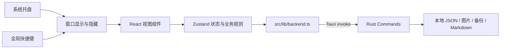

# 架构说明

## 1. 项目目标

个人工作面板是一款 Windows 单机、Local-first 的常驻托盘效率工具。重点是低打扰、数据本地化、快捷呼出和清晰的项目推进结构，不提供多用户、云同步或服务端能力。

## 2. 技术选择

### Tauri 2 + Rust

**选择原因：** 提供 Windows 托盘、全局快捷键、窗口控制、本地文件和打包能力，发布体积与常驻资源开销低。

**未选择 Electron：** Electron 开发生态成熟，但会携带 Chromium/Node 运行时，安装体积和常驻内存更高，不符合轻量常驻工具定位。

**维护成本：** 需要维护 Rust 和前端两套编译链，但 Tauri 边界集中在 `src-tauri`，复杂度可控。

### React + TypeScript + Zustand

**选择原因：** 组件化适合三个主视图和任务详情组合；TypeScript 约束数据模型；Zustand 以较少样板代码承载本地状态和异步持久化。

**未选择大型状态框架：** 当前是单窗口、单用户应用，不需要 Redux 等更复杂的事件和中间件体系。

### JSON 本地存储

**选择原因：** 当前数据量小、单进程读写、无需复杂查询，JSON 易备份和迁移；采用原子替换降低写入中断风险。

**未选择 SQLite：** SQLite 在并发、复杂查询和大数据量时更强，但当前会增加迁移和数据库抽象成本。数据规模增长后可在保持命令接口不变的情况下替换。

## 3. 系统结构

## 4. 模块职责

| 模块 | 职责 |
|---|---|
| `src/App.tsx` | 应用外壳、导航、窗口模式与弹窗组合 |
| `src/motion.css` | 动效设计令牌、组件进入/反馈动画与减少动效降级 |
| `src/components/TodayView.tsx` | 今日待办会话与真实 Todo 联动 |
| `src/components/IdeasView.tsx` | 灵感记录 |
| src/components/ProjectsView.tsx | 项目列表、筛选和统计 |
| src/components/EditableTaskName.tsx | 进行中项目名称的原地编辑、输入验证和键盘交互 |
| `src/components/TaskDetail.tsx` | Todo、Issue、总结、完成与导出 |
| `src/store.ts` | 状态模型、序号规则、业务操作、持久化触发 |
| `src/lib/backend.ts` | 浏览器测试替身与 Tauri invoke 适配 |
| `src-tauri/src/lib.rs` | 文件存储、备份、图片、导出、托盘、窗口、快捷键、自启动 |
| `src-tauri/src/main.rs` | 原生进程入口和 Windows 子系统声明 |

## 5. 数据流

1. 应用启动时，前端通过 `load_database` 读取本地 JSON。
2. 用户操作先更新 Zustand 内存状态。
3. 状态变化通过 `save_database` 序列化到 Rust 后端。
4. Rust 使用临时文件写入并替换主文件，保留可恢复备份。
5. 图片由 Rust 复制至应用数据目录，前端只保存本地路径。
6. Markdown 导出由 Rust 创建导出目录、复制资源并写入相对引用。

核心实体：`Task`、`Todo`、`Issue`、`Idea`、`Settings`、持久化自增 `Counters`。时间使用 ISO 8601 字符串。

项目重命名通过 `renameTask(id, name)` 写入真实 Task；状态层统一去除首尾空格、拒绝空名称，并遵守“已完成项目除总结外只读”的规则。退出应用前通过 `flushPendingSaves()` 等待串行保存队列，降低最后一次编辑尚未落盘的风险。

## 6. 桌面进程与窗口生命周期

- **开发模式：** `tauri dev` 由终端托管，保留控制台日志；关闭开发终端会结束开发进程。
- **正式模式：** Release 构建在 Windows 上声明 `windows_subsystem = "windows"`，进程不创建 CMD，可独立运行。
- 主窗口配置 `skipTaskbar: true`，不在任务栏显示。
- 顶部 `—` 调用 `hide_window`，仅隐藏至系统托盘并保持进程运行。
- 顶部 `X` 先等待前端保存队列完成，再调用 `quit_app` 彻底退出；托盘“退出”同样调用 `app.exit(0)`。
- 系统级 CloseRequested 仍被转换为隐藏，避免外部窗口关闭事件误杀托盘进程。
- 小窗使用 DPI 友好的逻辑像素：默认 `620×720`、最小 `560×640`；主窗口默认 `1180×780`。
- `Ctrl + Shift + Space` 和托盘左键共享显示/隐藏逻辑。
- 开机启动传入 `--minimized`，启动后直接隐藏窗口。

## 7. 动效架构

- `styles.css` 负责布局、颜色和组件静态状态；`motion.css` 作为独立动效层，在基础样式之后加载。
- 统一令牌控制 120ms、200ms、320ms 三档时长，避免各组件使用无规律的动画速度。
- 进入动画使用透明度与 `translate`/`transform`，优先交给 WebView2 合成线程处理；不使用会持续触发布局计算的宽高补间。
- 列表错峰最多延迟 165ms，提供层级感但不阻塞点击；数据状态仍由 Zustand 同步更新。
- To-do 完成使用一次性勾选反馈，“进行中”状态点使用低频呼吸提示，避免无业务含义的持续装饰动画。
- `prefers-reduced-motion: reduce` 会将动画和过渡降到近乎即时，并覆盖伪元素，满足动效敏感用户和低性能环境需要。
- 未引入动画框架。替代方案 Framer Motion 更适合复杂退出动画和手势编排，但当前需求可由 CSS 完成，引入后会增加包体、API 和维护成本。
## 8. 权限与安全边界

- 应用仅访问自身应用数据目录以及用户通过系统对话框选择的备份/导出目标。
- Tauri capability 控制前端可调用能力。
- 无网络后端、无登录、无密钥。
- 图片和 JSON 均留在本机。
- 发布 EXE 未签名时可能触发 SmartScreen；正式分发可增加代码签名证书。

## 9. 构建与部署

构建链：Vite/TypeScript → 静态前端资源 → Cargo Release → Windows EXE → 可选 MSI/NSIS 安装包。

生产产物不依赖 Node.js 或开发终端，但依赖 Windows WebView2 Runtime。使用 `scripts/verify-windows-subsystem.ps1` 检查 PE 子系统必须为 `Windows GUI (2)`。

## 10. 扩展方向

- 数据量明显增长时，将 Rust 存储实现替换为 SQLite，同时保持 Tauri command 契约稳定。
- 增加 Rust 单元测试覆盖路径、原子写入和 Markdown 转义。
- 增加代码签名和自动化 Release 流水线。
- 按业务边界继续拆分 `src-tauri/src/lib.rs`，避免后端逻辑长期集中在单文件。

## 11. 开源发布与供应链

- 源码仓库只跟踪前端、Rust/Tauri 源码、锁文件、图标、测试、脚本与文档。Node/Rust 构建目录、开发机安装程序、日志、调试符号、本地环境文件和 EXE 均由 `.gitignore` 排除。
- 可执行成品通过 GitHub Releases 作为版本资产分发，避免二进制混入源码历史；版本号在 `package.json`、`package-lock.json`、`src-tauri/Cargo.toml`、`src-tauri/Cargo.lock` 与 `src-tauri/tauri.conf.json` 中保持一致。
- 每次发布前依次执行前端测试、TypeScript/Vite 构建、`cargo check`、Tauri Release 构建和 Windows PE 子系统校验。
- 发布截图只能使用虚构演示数据；禁止上传应用数据目录、备份、真实粘贴图片、密钥、个人绝对路径或系统日志。
- npm 与 Cargo 锁文件纳入版本控制，确保依赖解析可追踪。未来升级依赖时需在变更记录中说明用途、替代方案和维护影响。
