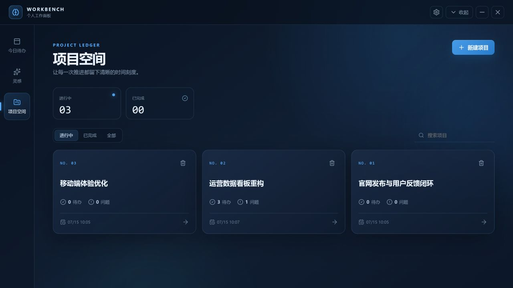
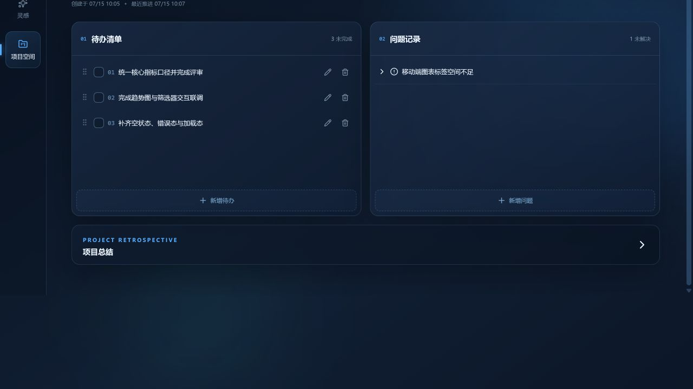
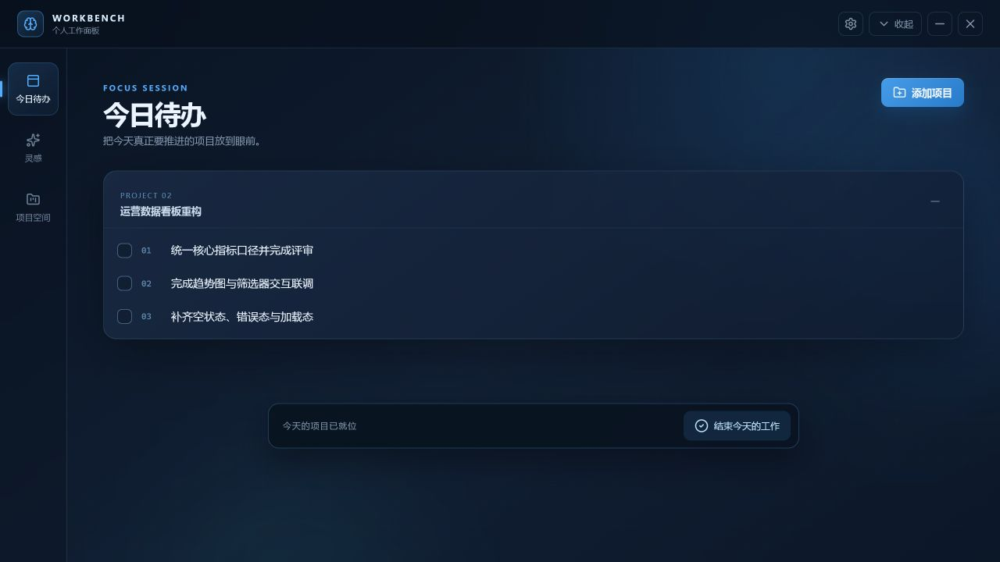

# 个人工作面板（Personal Work Panel）

一款面向 Windows 的本地优先个人效率工具。它常驻系统托盘，通过「今日待办」「灵感」「项目空间」三个视图管理项目、待办、问题与复盘；无需账号、服务器或数据库服务，业务数据默认只保存在本机。

> 当前版本：**v1.2.1** · 平台：**Windows 10/11 x64** · 许可证：**MIT**

## 界面预览

以下截图使用完全虚构的演示数据，不包含任何真实用户信息。

### 项目空间



### 项目详情



### 今日待办



## 主要能力

- 项目、待办、问题与项目总结管理
- 点击项目名称直接重命名，支持 Enter 保存、Esc 取消
- 今日待办工作会话，集中查看选定项目的未完成事项
- 灵感速记与本地图片保存
- 主窗口 / 小窗模式切换，小窗默认使用 620×720 逻辑像素
- 系统托盘驻留，默认不显示任务栏图标
- `Ctrl + Shift + Space` 全局快捷键呼出或隐藏
- 本地 JSON 原子写入、上一版本回退与批量 Markdown 导出
- 可选开机自启动
- 原生 CSS 动效与 `prefers-reduced-motion` 无障碍降级

## 开箱即用

### 普通用户

1. 打开项目的 [GitHub Releases](../../releases/latest) 页面。
2. 下载 `personal-work-panel-v1.2.0-windows-x64.exe`。
3. 双击运行，无需安装 Node.js、Rust 或数据库。
4. 使用 `Ctrl + Shift + Space` 呼出或隐藏窗口；也可以通过系统托盘操作。

> 当前发布文件未进行商业代码签名。Windows SmartScreen 首次运行时可能显示提醒，请只从本项目 Releases 页面下载，并在核对来源后决定是否运行。

### 开发者

#### 环境要求

- Windows 10/11 x64
- Node.js 20.19 或更高版本
- npm 10 或更高版本
- Rust stable 与 Cargo
- Microsoft C++ Build Tools（MSVC）和 Windows SDK
- Microsoft Edge WebView2 Runtime

#### 安装与启动

```powershell
git clone https://github.com/Changee-git/personal-work-panel.git
cd personal-work-panel
npm install
npm run tauri -- dev
```

浏览器预览模式（不含托盘、全局快捷键与本地文件导出等原生能力）：

```powershell
npm run dev
```

项目当前不依赖环境变量；`.env.example` 用于记录未来可能增加的变量名。不要提交真实的 `.env` 文件或密钥。

## 检查与构建

```powershell
npm test
npm run build
cargo check --manifest-path .\src-tauri\Cargo.toml
npm run tauri -- build
```

正式构建产物默认位于：

```text
src-tauri\target\release\personal-work-panel.exe
```

验证 Release EXE 使用 Windows GUI 子系统，不会伴随控制台窗口：

```powershell
powershell -ExecutionPolicy Bypass -File .\scripts\verify-windows-subsystem.ps1 `
  -ExePath .\src-tauri\target\release\personal-work-panel.exe
```

## 使用说明

1. 在「项目空间」创建项目，并在项目详情中拆分 Todo、记录 Issue 或维护项目总结。
2. 在「今日待办」中选择当天需要推进的项目，应用会实时汇总其中尚未完成的 Todo。
3. 在「灵感」中快速保存文字和剪贴板图片。
4. 顶部「—」只隐藏到系统托盘；顶部「X」会等待保存队列完成后退出。
5. 可在设置中切换开机启动，并全选或指定项目批量导出 Markdown。
6. 默认导出到应用所在根目录的 `export` 文件夹，也可通过系统文件夹选择器自定义路径。
7. 已完成项目整体只读，但项目总结仍可继续补充。

## Markdown 导出

- 设置页默认全选全部项目，也可以取消全选后仅勾选特定项目。
- 每个项目生成一个独立的 Markdown 文件；相关配图复制到同名的 `_assets` 文件夹，并使用相对路径引用。
- 已完成待办导出为 `[√]`，未完成待办导出为 `[ ]`。
- 默认目录为 `<应用根目录>\export`。源码开发时会识别仓库根目录；发布版使用 EXE 所在目录。
- 如果应用目录没有写入权限，请在设置中点击“自定义”并选择可写文件夹。

## 数据与隐私

- 应用不提供账号、云同步、遥测或网络后端。
- 业务数据与粘贴图片保存在当前 Windows 用户的 Tauri 应用数据目录中，不会写入源码目录。
- Markdown 默认写入应用所在根目录的 `export` 文件夹；自定义导出只写入用户通过系统对话框选择的位置。
- 仓库不跟踪本地数据、环境文件、构建产物、安装工具或发布 EXE；可执行成品通过 GitHub Releases 分发。
- 详细说明见 [PRIVACY.md](PRIVACY.md)；安全问题请按 [SECURITY.md](SECURITY.md) 报告。

## 技术栈与选择

- **桌面壳：** Tauri 2 + Rust
- **前端：** React 19 + TypeScript + Vite
- **状态管理：** Zustand
- **拖拽排序：** dnd-kit
- **检查：** TypeScript + Vite 生产构建
- **数据存储：** Tauri 应用数据目录中的本地 JSON

选择 Tauri 是为了复用系统 WebView2，并获得托盘、窗口、快捷键和本地文件能力。相比 Electron，它的发布体积与常驻资源占用通常更低；代价是 Windows 构建环境需要 Rust、MSVC Build Tools 和 Windows SDK。当前数据规模适合 JSON，避免引入数据库运行时；若未来数据规模或查询复杂度明显增长，可在保持 Tauri command 契约稳定的前提下迁移到 SQLite。

## 目录结构

```text
personal-work-panel/
├── src/                       # React 前端源码
│   ├── components/            # 业务视图与复用组件
│   ├── lib/                   # Tauri 后端调用封装
│   ├── store.ts               # 状态与业务操作
│   └── *.test.ts(x)           # 前端测试
├── src-tauri/                 # Rust/Tauri 桌面端
│   ├── capabilities/          # Tauri 权限配置
│   ├── icons/                 # Windows 应用图标
│   └── src/                   # 原生能力与数据持久化
├── docs/screenshots/          # README 界面截图（虚构演示数据）
├── scripts/                   # 构建产物验证脚本
├── README.md                  # 安装、使用与发布说明
├── ARCHITECTURE.md            # 架构、模块和数据流
├── CHANGELOG.md               # 版本更替信息
├── PRIVACY.md                 # 数据与隐私说明
├── SECURITY.md                # 安全报告方式
├── LICENSE                    # MIT 许可证
└── .env.example               # 环境变量模板
```

## 依赖说明

本次开源整理**没有新增运行依赖或开发依赖**。现有依赖的职责、替代方案与维护影响记录在 [ARCHITECTURE.md](ARCHITECTURE.md)。锁文件 `package-lock.json` 与 `src-tauri/Cargo.lock` 会一并提交，以保证构建可复现。

## 文档与版本

- [架构说明](ARCHITECTURE.md)
- [版本记录](CHANGELOG.md)
- [需求文档](项目开发需求.md)
- [隐私说明](PRIVACY.md)
- [安全策略](SECURITY.md)

版本遵循 [Semantic Versioning](https://semver.org/lang/zh-CN/)。正式成品通过 GitHub Releases 分发，源码仓库保持只包含可审查、可复现构建所需的内容。

## 许可证

本项目使用 [MIT License](LICENSE) 开源。

## 发布目录说明

仓库根目录仅保留一个可直接双击运行的 `个人工作面板.exe`。
开发者重新构建前先运行 `npm install`，再运行 `npm run check` 和 `npm run tauri -- build --no-bundle`。

`npm run check` 执行 TypeScript 检查和前端生产构建；按项目整理要求，不再保留独立前端测试文件及测试专用依赖。
